# Building Your First Website

In this tutorial, you will be learning how to build your first website.

There are two parts of this tutorial:

In part 1, we'll be using the website [Dash](dash.generalassemb.ly) to learn the
fundamentals of building a website.

Then in part 2, we'll be making our website using a tool called [Cloud9](c9.io).
Think of Cloud9 as one of the Microsoft Word to code in.

## Part 1: Dash

### Signing up

Let's signup for Dash by registering [here](https://accounts.generalassemb.ly/users/sign_up)

### Doing project 1

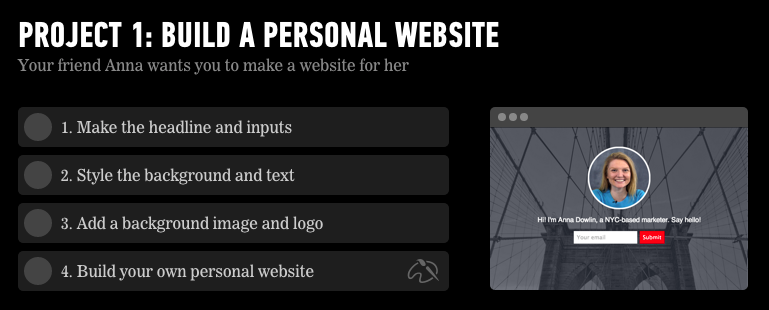

Go ahead and finish the first three sections of Project 1:

- Make the headline and inputs
- Style the background and text
- Add a background image and logo
- [SKIP] Build your own personal website

## Part 2: Cloud9

You should have finished making your first webpage in Dash.

It should look something like this:


And the HTML code should look something like this:

```html
<!DOCTYPE html>
<head>
  <style>
    body {
      text-align: center;
      font-family: helvetica;
      background: url("http://dash.ga.co/assets/anna-bg.png");
      background-size: cover;
      background-position: center;
      color: white;
    }

    p {
      font-size: 22px;
    }

    input {
      border: 0;
      padding: 10px;
      font-size: 18px;
    }

    input[type="submit"] {
      background-color: red;
      color: white;
    }
  </style>
  <title>Anna Dowlin</title>
</head>
<body>
  
  <h1>Anna Dowlin</h1>
  <p>Hi! I'm Anna, a NYC-based marketer. Say hello!</p>
  <input type="email" placeholder="Your email">
  <input type="submit">
</body>
```

### Objectives of this next section:

- Learn to setup and use Cloud9
- Learn how to teach yourself new coding concepts with Google

We will be achieving these above objectives by
- moving the code from Dash to Cloud9
- adding more components to the HTML page

###

# Setting up your workspace

Just like you may write your English essays in Microsoft Word or Google Docs we will be writing code in Cloud9.

## Open [`github.com`](http://github.com)

Github lets you collaborate on writing online.

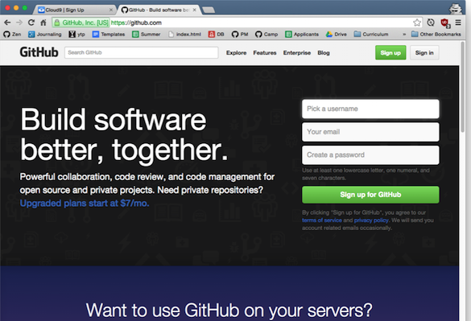

## Create an account with a valid eamil
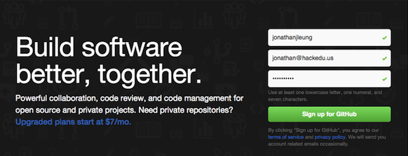

## Click "Sign up for Github"
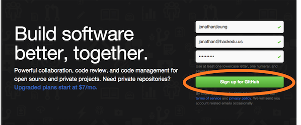

## Authorize Github
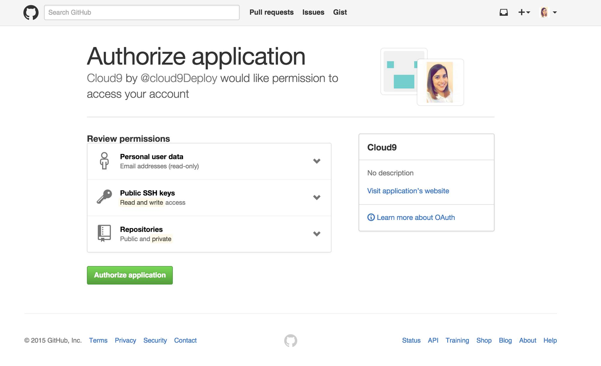

## Validating your Email Address

- Check your email inbox for a confirmation email from github
- Make sure you click on the link it tells you to to confirm your account.

> *Important Note*: If you don't do this now, the latter part of this tutorial will not work for you!

## Open [`c9.io`](http://c9.io)

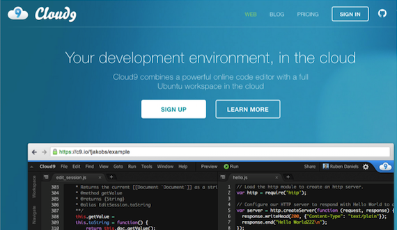

# Click "SIGN UP"

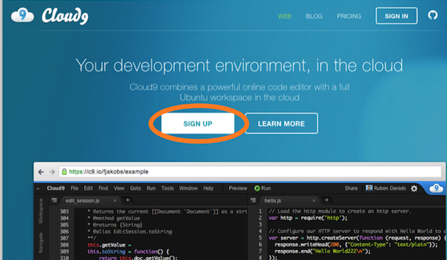

## Click "GitHub"

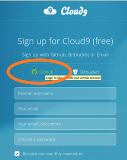

## Sign In with Github

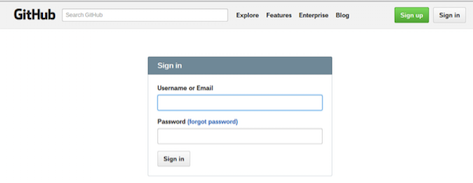

## Click on the "+" button

This creates a new Cloud9 workspace.

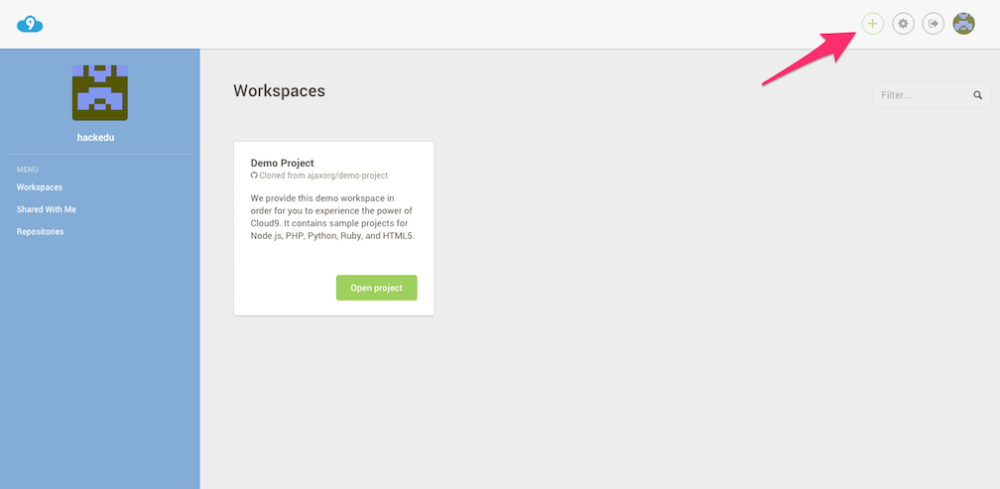

## Set the workspace name to `hack-camp`

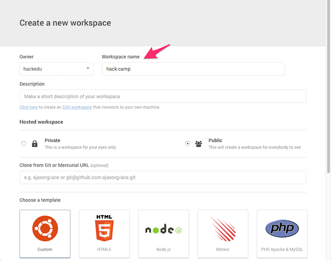

## Click "Custom"

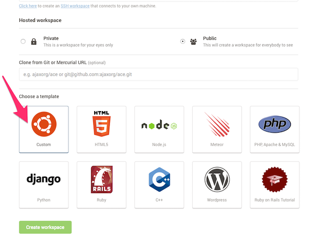

## Click "Create Workspace"

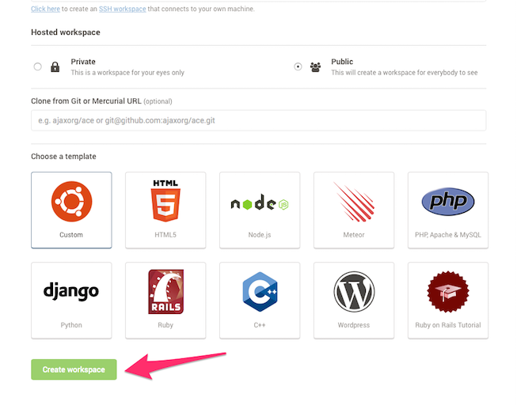

## Click on the Welcome Screen

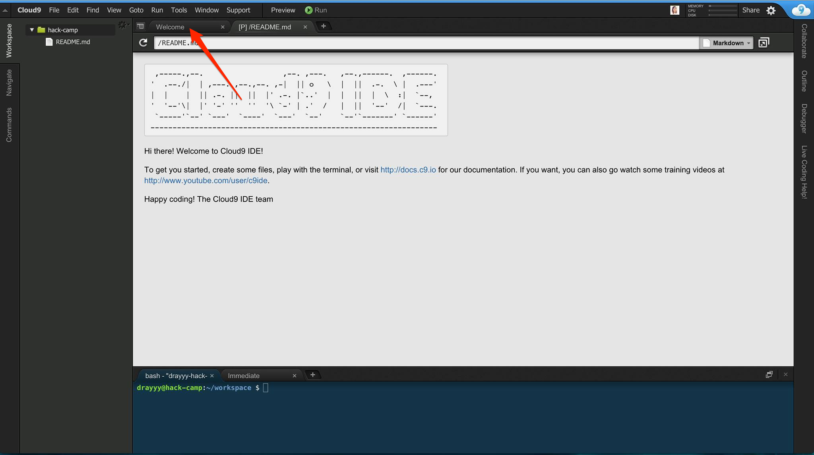

## Scroll Down

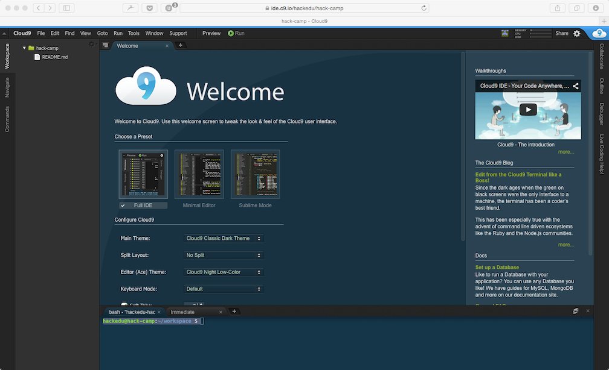

## Update the settings

- Change `Soft Tabs` to `2`
- Enable `Auto-Save`
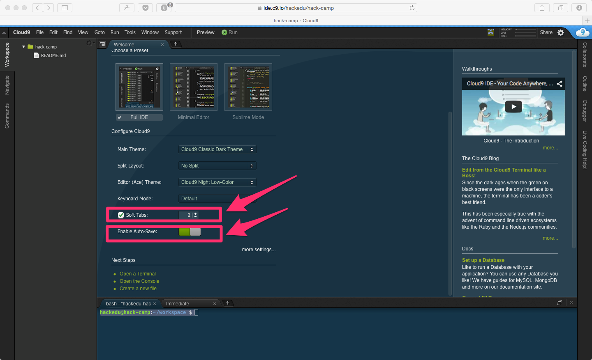

## The Terminal

When we talk about the terminal, this is what we are referring to.

This is another user interface for running commands on the computer.


## Start the Server

- Paste the following command into the terminal

    ```
    curl -sL https://git.io/vtbp6 | sudo dd of=/usr/local/bin/live_reload && sudo chmod +x /usr/local/bin/live_reload && live_reload
    ```

- hit `enter`.

- this may take a few minutes to finish.

## In the mean time, close the Welcome Tab

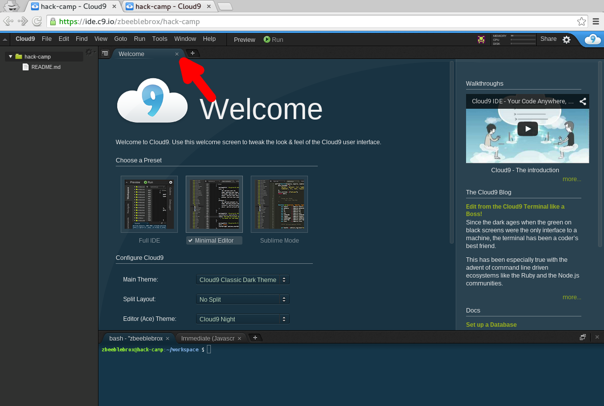

## Next

Great, now you've finished setting up your Cloud9 workspace!

The next step is to
[create the folders and files for your website.](file_creation.md)

## Setting up your workspace

Just like you may write your English essays in Microsoft Word or Google Docs we
will be writing code in Cloud9.

### Open [`github.com`](http://github.com)

Github lets you collaborate on code online.


### Create an account with a valid email


### Click "Sign up for Github"


### Authorize Github


### Validating your Email Address

- Check your email inbox for a confirmation email from github
- Make sure you click on the link it tells you to to confirm your account.

> *Important Note*: If you don't do this now, the latter part of this tutorial
> will not work for you!

### Open [`c9.io`](http://c9.io)


### Click "SIGN UP"


### Click "GitHub"


### Sign In with Github


### Click on the "+" button

This creates a new Cloud9 workspace.


### Set the workspace name to `hack-camp`


### Click "Custom"


### Click "Create Workspace"


### Click on the Welcome Screen


### Scroll Down


### Update the settings

- Change `Soft Tabs` to `2`
- Enable `Auto-Save`


### The Terminal

When we talk about the terminal, this is what we are referring to.

This is another user interface for running commands on the computer.


### Start the Server

- Paste the following command into the terminal

    ```
    curl -sL https://git.io/vtbp6 | sudo dd of=/usr/local/bin/live_reload && sudo chmod +x /usr/local/bin/live_reload && live_reload
    ```

- hit `enter`.

- this may take a few minutes to finish.
- This starts up the server. You can google what a server is for more information.

### In the mean time, close the Welcome Tab


### Next

Great, now you've finished setting up your Cloud9 workspace!

The next step is to [create the folders and files for your website.](file_creation.md)

## Creating your project files

### Creating the project folder

For each project that we work on, we want to create a new folder for it.

We are creating a new portfolio website so lets make a new folder for our
project named `portfolio`

- On the left file pane, right click and click `New Folder` to create a new
folder.
- Name it `portfolio`.

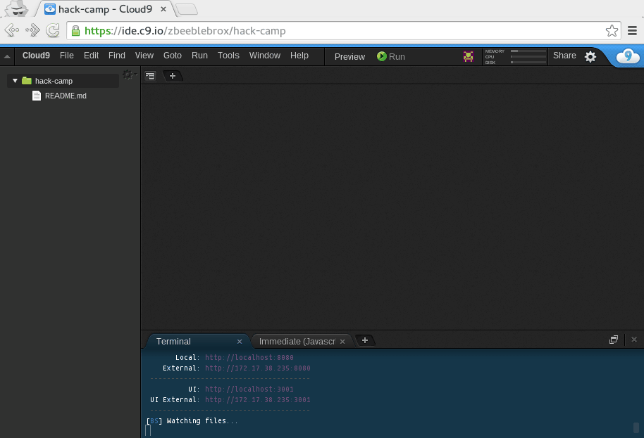

### Creating our `index.html`

- right click on the `portfolio` folder
- click `New File`
- name it `index.html`
- double click it to open it

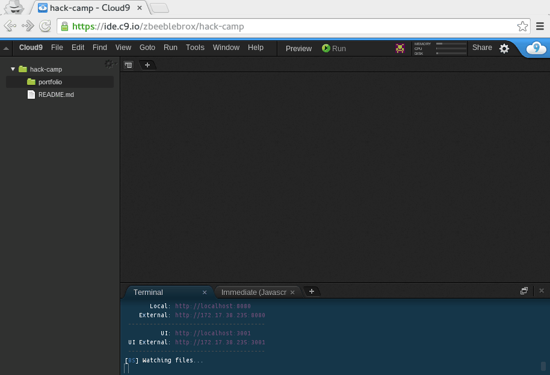

### Laying down the scaffold of every html page:

Paste in the code that we wrote from Dash.

### Previewing our work

Great! Now let's see if everything is setup properly by viewing the page
in Cloud9.

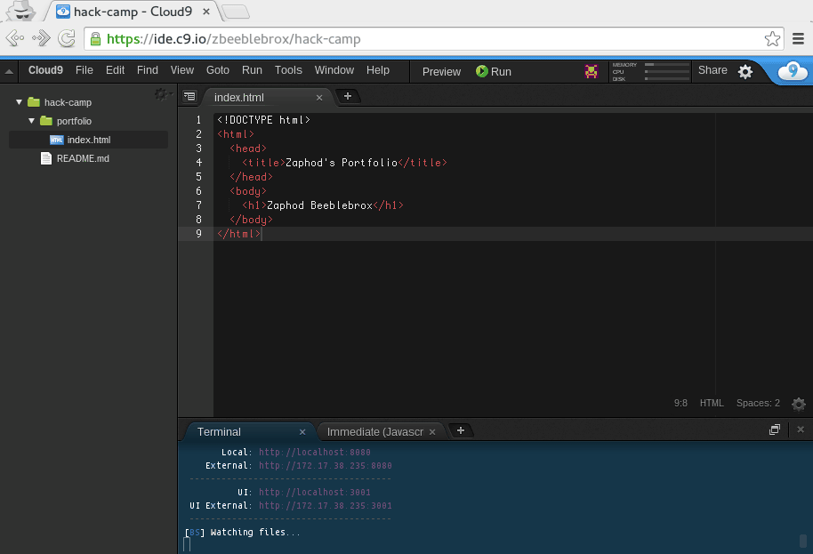

### We can also open the website in its own tab.

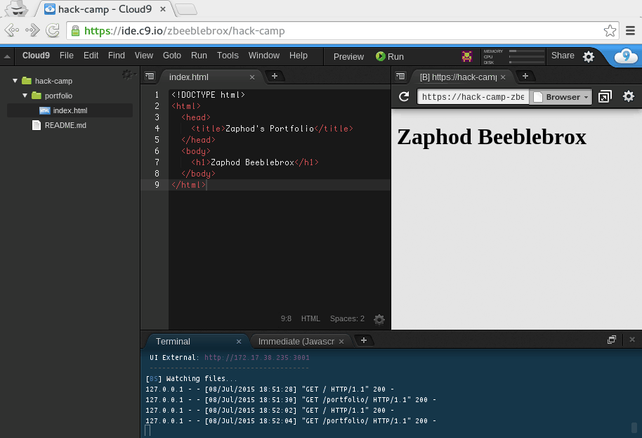

## Creating your own website

Now that you're familiar with Cloud9, let's create your own website.

## Objectives
