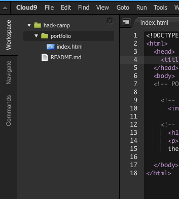

Now that you're familiar with Cloud9, let's learn how to move your CSS into
it's own file.

## Moving the CSS in it's own file

Instead of directly putting your CSS inside your HTML with style tags, we can
put the CSS inside of a separate file and reference this file in our HTML.

Why do we bother with this? Because separating the HTML (which is responsible
for the data) from the CSS (which is responsible for the look and feel) keeps
everything more organized.

If you want to learn more about this, ask a facilitator or google
`why separate html and css`

Take the code that's inside of your style tags (it should like the code
below)

> ```html
> <style>
>   body {
>     text-align: center;
>     font-family: helvetica;
>     background: url("http://dash.ga.co/assets/anna-bg.png");
>     background-size: cover;
>     background-position: center;
>     color: white;
>   }
>
>   p {
>     font-size: 22px;
>   }
>
>   input {
>     border: 0;
>     padding: 10px;
>     font-size: 18px;
>   }
>
>   input[type="submit"] {
>     background-color: red;
>     color: white;
>   }
> </style>
> ```

## Creating our CSS file

- Right click on your `portflio` folder
- Click `"New File"`
- Name the new file `main.css`



- Open the newly created file
- and paste your CSS code inside of it

## Telling the HTML about our CSS file

We need to tell the HTML file that we want it to load the CSS from our  `main.css` file


- Make a new line under the `<title>`
- Type `link`
- Press the `tab` key. this expands to:

  ```html
  <link rel="stylesheet" href="" type="text/css" />
  ```

- Set the `href` attribute to `main.css`

  ```html
  <link rel="stylesheet" href="main.css" type="text/css" />
  ```

### Understanding the link tag

The `<link>` tag "links" or "connects" the CSS file to the HTML.

```html
<link  href="main.css" rel="stylesheet" type="text/css" />
```

The `<link>` tag has many **attributes** including

- `href`
  - which defines the location of the css file
- `rel`
  - which defines the relationship between the linked file and the HTML file
    as it's `stylesheet`
- `type`
  - which defines the the type of the stylesheet as `text/css`


### Checkpoint

At this point our `index.html` file should look something like this:

```html
<!DOCTYPE html>
<head>
  <title>Anna Dowlin</title>
  <link rel="stylesheet" href="main.css" type="text/css" />
</head>
<body>
  
  <h1>Anna Dowlin</h1>
  <p>Hi! I'm Anna, a NYC-based marketer. Say hello!</p>
  <input type="email" placeholder="Your email">
  <input type="submit">
</body>
```

and our `main.css` should look like this:

```css
body {
  text-align: center;
  font-family: helvetica;
  background: url("http://dash.ga.co/assets/anna-bg.png");
  background-size: cover;
  background-position: center;
  color: white;
}

p {
  font-size: 22px;
}

input {
  border: 0;
  padding: 10px;
  font-size: 18px;
}

input[type="submit"] {
  background-color: red;
  color: white;
}
```

## Testing That It's Connected

Great! Now let's see if everything is setup properly by viewing the page
in Cloud9.

- Click the `Preview` menu on the top bar
- then click `Preview Running Application`
- then click `portfolio`

If it looks the same as before, we did everything right!

If not, try to fix it and call someone over if it doesn't work.
