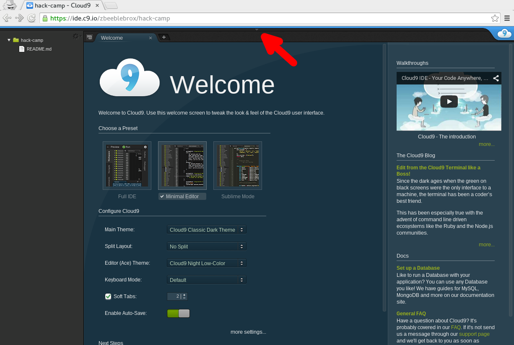
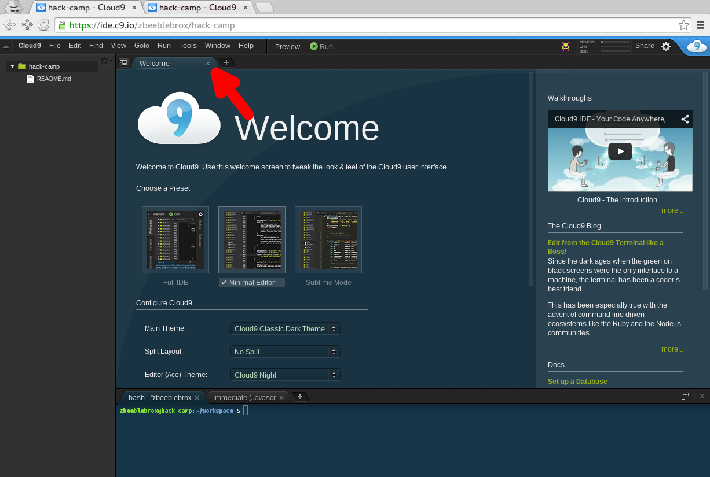
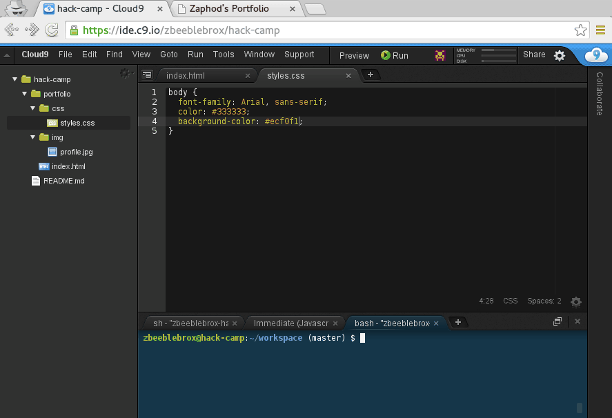

# Portfolio Website

- Go to https://c9.io, click the `Sign Up` button, and create an account
- Click `Go to your dashboard`
- Creating a workspace
  - Click `Create a new workspace`
  - Give it the name `hack-camp`
  - Make sure the `Custom` type is selected
  - Make sure your workspace is set to public
  - Click `Create workspace`
- Configuring your workspace
  - Select the `Minimal Editor` preset.
  - Change `Soft Tabs` to 2
  - Turn on `Enable Auto-Save`
  - At the very top of the window, click the little triangle on the bar to
    show the Cloud9 menu bar.

    

  - Click `View` and then `Console` to open up the terminal
  - Your workspace should now look like the following:

    

  - Go ahead and close the welcome tab

    

  - Final step, paste the following command into the terminal on the bottom
    and hit enter. This may take a few minutes to finish.

        curl -sL https://git.io/vtbp6 | sudo dd of=/usr/local/bin/live_reload && sudo chmod +x /usr/local/bin/live_reload && live_reload

  - When it's done, your workspace should look like the following

    
- Getting off the ground
  - On the left file pane, right click and click `New Folder` to create a new
    folder. Name it `portfolio``

    

  - Create a new file inside of portfolio called `index.html` and double click
    it to open it

    

  - Go ahead and type the following code into the open file (don't copy and
    paste it! and make sure to indent properly!). Replace "Zaphod" with your
    first name and "Zaphod Beeblebrox" with your first and last name.

    ```html
    <!DOCTYPE html>
    <html>
      <head>
        <title>Zaphod's Portfolio</title>
      </head>
      <body>
        <h1>Zaphod Beeblebrox</h1>
      </body>
    </html>
    ```

    

  - Let's see what our website looks like so far.

    

  - We can also open the website in its own tab.

    
- What have we done so far?
  - So what was that code we typed? Spoiler alert: almost every website on the
    internet is secretly written in a language called **HyperText Markup
    Language**, otherwise known as "HTML". So why don't you see code
    everywhere? Well, your browser reads HTML for you and just shows you the
    pretty version. It is sheltering you!
  - We'll get our hands a bit dirtier with the basics of HTML. We'll talk a
    little about formatting, links, and images so you can make a simple, but
    ugly, webpage.
  - If you want to make it pretty, we'll also do a quick dive into Cascading
    Syle Sheet (CSS), which many websites secretly use to make themselves
    pretty.
  - The basic building blocks of HTML are _HTML elements_. HTML elements are
    denoted by angled brackets. These are called **tags**. `<html>`, `<head>`,
    `<body>`, `<title>`, and `<h1>` are all tags.
  - All of the tags listed above are referred to as start tags - and if you
    start something, you need to end it. The end tag is exactly the same as
    the start tag with a cute forward slash (`/`) after the `<`. Consequently
    the end tag for `<html>` is `</html>`. The end tag for `<head>` is
    `</head>`, and so on.
  - HTML documents contain two important parts, denoted by tags:
    1. **head** - contains information about the document that is _not
       displayed on the screen_.
    2. **body** - contains everything that id displayed on the webpage.
  - Don't worry if you don't understand everything so far! You'll get a better
    understanding of these concepts as you write more code. As always, the
    most important thing is to ask a lot of questions!
    - _Warning_: some of the wording in this section was taken from Codecademy -
      remember to change this.
- Let's get this website on the real internet.
  - [GitHub](https://github.com/) is where millions of developers store their
    code online. One of their services,
    [GitHub Pages](https://pages.github.com/), will put a website online for
    you. We'll be using GitHub pages to host our portfolio.
  - Head over to https://github.com/ and create a free account.

    

  - Before proceeding, **verify the email on your GitHub accounts**. The
    following steps _will not_ work if you don't do this. If you check your
    inbox, you'll see an email from GitHub with a confirmation link.
  - Once you have an account created, go to the GitHub homepage at
    https://github.com and create a new repository with the name
    _username_.github.io (replacing _username_ with your GitHub username).
    Make sure `Initialize this repository with a README` **is not** checked.

    

  - To use GitHub, we need to use another tool called git. Git is a tool that
    lets us take "snapshots" of the code we've written so far. GitHub is a
    place where we can store our git projects and collaborate with others. Do
    note, GitHub and git are _not_ the same thing. We'll go further into the
    distinction later.
  - Git is already installed on Cloud9. Go ahead and open a new terminal tab
    and run the command `git init` to create a new git project.

    

  - Go ahead and run `git add -A :/` and then `git commit -m "Initial
    commit."` in the terminal. Don't worry about what these two commands mean,
    they're just telling git to create a snapshot of our code and adding the
    message "Initial commit." to the snapshot.

    

  - Final step. Let's tell git to upload our code to GitHub. Run the following
    two commands in your terminal, replacing `username` with your GitHub
    username. It'll prompt you for your GitHub username and password, go ahead
    and enter those. Don't worry if it doesn't display any characters while
    you type your password, just hit enter when you're done and all should be
    well with the world.

    ```
    $ git remote add origin https://github.com/username/username.github.io
    $ git push -u origin master
    ```

    

  - Great! Now if you head over to
    https://{username}.github.io/portfolio/index.html (replace {username} with
    your GitHub username), you'll see the site we just made deployed live. It
    may take a few minutes for GitHub to prepare your site. If you get an
    error, no worries, just wait a few minutes and try again.
- Adding more content
  - We previously used an `h1` tag to create a heading in our website.
    Headings are a way to order the content in the `body`. We can use the `h1`
    to `h6` tags to define them. `h1` is the "most important", and then these
    tags gradually become "less important" until you reach `h6`, the "least
    important".

    ```html
    <h1>The Onion</h1>
    <h2>Posts</h2>
    <h3>Son-Of-A-Gun Mouse Solves Maze Researchers Spent Months Building</h3>
    <h3>Informal Tone Of Cover Letter Sets Job Applicant Apart From Seriously
    Considered Candidates</h3>
    <h2>More Heading Examples</h2>
    <h3>A Heading</h3>
    <h4>A Heading</h4>
    <h5>A Heading</h5>
    <h6>A Heading</h6>
    ```
    
    

  - **Challenge time:** we previously used an `h1` tag inside of the `body`
    tag to create a heading with our name on our webpage. Create a smaller
    heading to put the projects we create under. Here's what it should look
    like:

    

  - Let's talk about lists. Lists can be created with either the `ul`
    (unordered) or `ol` (ordered) list tags. We put `li` tags inside of `ul`
    or `ol` for each element.

    ```html
    <h1>Unordered List</h1>
    <ul>
      <li>Eggs</li>
      <li>Lime</li>
      <li>Sharp cheddar</li>
    </ul>
    <h1>Ordered List</h1>
    <ol>
      <li>October</li>
      <li>November</li>
      <li>December</li>
    </ol>
    ```
    
    

  - **Challenge time:** create a list under the previously created "Projects"
    headline and add this project to it. Here's what it should look like:

    

  - Let's go ahead and tell git to create a snapshot of our current changes.
    Run `git add --all` to tell git about our changes, `git commit -m "Add
    projects list."` to create a snapshot with the message "Add projects
    list.", and then `git push` to upload it to GitHub.

    

  - Your changes should now be live at
    https://{username}.github.io/portfolio/index.html

  - Now let's add a picture of ourselves to the site. Create a directory
    called `img` in our portfolio directory and upload a picture of yourself
    (or something else, if you'd rather not share a picture of yourself
    online).

    

  - Time to add the image we uploaded to our site. We can use the `img` tag to
    do this. The `img` tag has an attribute inside of it called `src` that we
    can use to specify the location of the image. Unlike most tags in HTML, we
    don't need a closing tag for the `img` tag.

    

    Let's go ahead and add an image tag above our "Projects" heading for our
    profile picture. Replace `profile.jpg` with the name of the file you
    uploaded.

    ```html
    
    ```

    

  - Let's take a snapshot of our changes with git and upload it to GitHub. Run
    the following commands.
  - `git add --all` - tell git to add all of our changes to the current
    snapshot
  - `git commit -m "Add profile picture."` - tell git to create a snapshot
    with the message "Add profile picture."
  - `git push` - upload our changes to GitHub

    

  - Great! Last bit of content - let's link to our Facebook profile. You're
    welcome to link to something else though!
  - Links in HTML are created with the `a` tag. We need to set the `href`
    attribute to say where the link should go.

    

  - Let's go ahead and add a link to our Facebook right under our profile
    image. Replace {url} with a link to your Facebook profile.

    ```html
    <p>
      <a href="{url}">Facebook</a>
    </p>
    ```

    
  - Notice how we put the `a` tag inside of a `p` tag. The `p` tag means
    paragraph - anything we put inside of it is considered to be part of a
    paragraph.
- Time to make our website prettier
  - While HTML lets us put all sorts of interesting content on our page, it
    has very poor taste in fashion - as we've seen. Second spoiler alert:
    nearly every website on the internet is secretly made pretty with
    **Cascading Style Sheets**, otherwise known as "CSS". Let's spice up our
    portfolio with CSS.
  - Create a new folder in `portfolio` called `css` and create a file called
    `styles.css` in it. Double click it to open it. 

    

  - Let's head back over to `index.html` and add
  `<link href="css/styles.css" rel="stylesheet">` in the `head` tag. This
  tells the browser to refer to the `css/styles.css` we just created for our
  beautifying needs.

    

  - Let's go ahead and start adding some CSS to `styles.css`. Let's start by
    changing the font and text color. Anything between `/*` and `*/` is called
    a _comment_ and is ignored by the web browser - comments are just notes to
    ourselves. Don't worry about retyping the comments for now.

    ```css
    body {
      /* Use the Arial font. If it's not there, use another sans serif font. */
      font-family: Arial, sans-serif;
      /* Change the text color to a dark grey. */
      color: #333333;
    }
    ```

    

  - This CSS is telling the browser to set the `font-color` of everything
    within the `body` tag (all of the page content) to `Arial, sans-serif` and
    to set the `color` of everything within the `body` tag (again, everything
    we see on the page) to `#333333`.
  - You may be wondering how `#333333` means dark grey. When we're creating
    websites, we have another way of representing colors with a sequence of
    six numbers and letters, called "hex". All you need to know is that you
    can use http://www.colorpicker.com/ to choose colors and get the hex codes
    for them (and https://flatuicolors.com/ if you want some preset colors!).
  - Let's create a snapshot of our CSS additions with git. Run the following
    commands:
    - `git add --all` - tell git to add all of our changes to the current
      snapshot.
    - `git commit -m "Start styling the page with CSS."` - create a snapshot
      with the message "Start styling the page with CSS."
    - `git push` - upload our snapshot to GitHub

    

  - Final thing - let's change the background of the page to be slightly
    off-white. We'll be setting the `background-color` property in the `body`
    tag to the `clouds` color from https://flatuicolors.com.

    

  - Great! Let's create a snapshot of this change with git and upload it to
    GitHub. As we've done before, run the following commands:
  - `git add --all` - tell git to add all of our current changes to the
    current snapshot.
  - `git commit -m "Change background to off-white."` - create a snapshot
    with the message "Change background to off-white."
  - `git push` - upload our snapshot to GitHub

    

- We made it!

  

  - Alright! We made it! To recap what we did:
    - Created account on Cloud9 and set it up as our development environment
    - Wrote the content of our portfolio website in HTML
    - Made the content of our portfolio pretty with CSS
    - Used git to create snapshots of our code as we wrote it
    - Created account on GitHub and uploaded our git snapshots to it
    - Hosted our website on GitHub pages at https://github_username.github.io/portfolio/index.html
