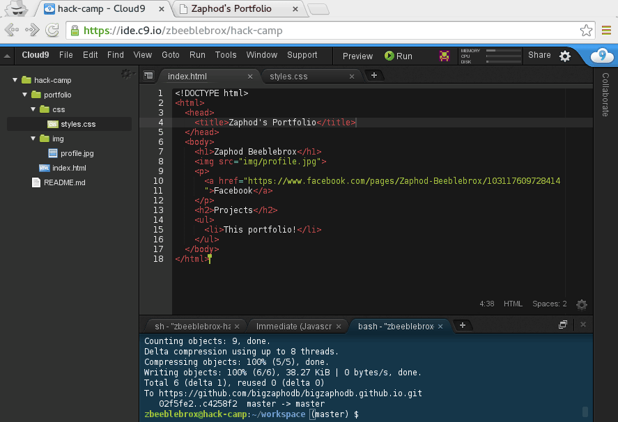
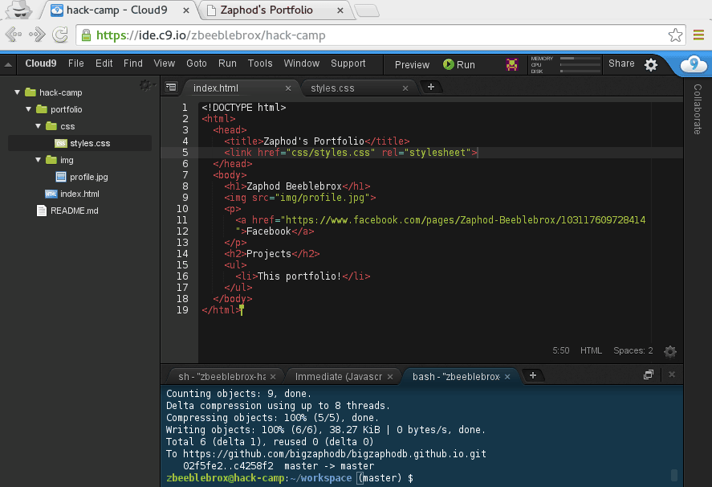

# Adding CSS

Time to make our website prettier
While HTML lets us put all sorts of interesting content on our page, it
has very poor taste in fashion - as we've seen. Second spoiler alert:
nearly every website on the internet is secretly made pretty with
**Cascading Style Sheets**, otherwise known as "CSS". Let's spice up our
portfolio with CSS.

## Adding our CSS Files
Create a new folder in `portfolio` called `css` and create a file called
`styles.css` in it. Double click it to open it. 

> 

## Telling the HTML about our CSS file
Let's head back over to `index.html` and add 

```
<link href="css/styles.css" rel="stylesheet">
```

in the `head` tag.

This tells the browser to refer to the `css/styles.css` we just created for our beautifying needs.

> 

## Adding some styles to our CSS file

Let's go ahead and start adding some CSS to `styles.css`. Let's start by
  changing the font and text color. Anything between `/*` and `*/` is called
  a _comment_ and is ignored by the web browser - comments are just notes to
  ourselves. Don't worry about retyping the comments for now.

```css
body {
  /* Use the Arial font. If it's not there, use another sans serif font. */
  font-family: Arial, sans-serif;
  /* Change the text color to a dark grey. */
  color: #333333;
}
```

> 

This CSS is telling the browser to
- set the `font-color` of everything within the `body` tag (all of the page content) to `Arial, sans-serif` 
- set the `color` of everything within the `body` tag (again, everything
we see on the page) to `#333333`.
- You may be wondering how `#333333` means dark grey. When we're creating
websites, we have another way of representing colors with a sequence of
six numbers and letters, called "hex". All you need to know is that you
can use http://www.colorpicker.com/ to choose colors and get the hex codes
for them (and https://flatuicolors.com/ if you want some preset colors!).
Let's create a snapshot of our CSS additions with git. 

## Adding these changes to our live Github website

Run the following commands:

- `git add --all` - tell git to add all of our changes to the current
  snapshot.
- `git commit -m "Start styling the page with CSS."` - create a snapshot
  with the message "Start styling the page with CSS."
- `git push` - upload our snapshot to GitHub

> 

## Changing the background color

Final thing — let's change the background of the page to be slightly
off-white. We'll be setting the `background-color` property in the `body`
tag to the `clouds` color from https://flatuicolors.com.

> 

Great! Let's create a snapshot of this change with git and upload it to
GitHub. As we've done before, run the following commands:
- `git add --all` - tell git to add all of our current changes to the
current snapshot.
- `git commit -m "Change background to off-white."` - create a snapshot
with the message "Change background to off-white."
- `git push` - upload our snapshot to GitHub

> 

## We made it!


[Recap](recap.md)