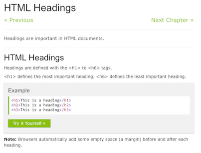

# Adding Name Challenge

Let's figure out how to add `Jonathan Leung` in the `INFORMATION SECTION`

```
<!-- PORTFOLIO -->

  <!-- IMAGE SECTION -->
    - http://i.imgur.com/vS0HhER.jpg 
  
  <!-- INFORMATION SECTION -->
    - Jonathan Leung            <!-------------------- NEXT -->
    - I want show people that the world is malleable. I want them to know they can create what's missing and not be afraid to break the status quo.

  <!-- SOCIAL MEDIA SECTION -->
    - link to Facebook (https://twitter.com/jonathanjleung)
    - link to Twitter (https://twitter.com/jonathanjleung)
    - link to Github (https://github.com/jonleung)
```

## How the rest of this tutorial will work.

Instead of telling you all the answers in our tutorials, we want to show you how you can disover the answer for yourself using Google. We do this so that after hack camp, you will still be able to figure out how to do things that you don't know how to do.

Know that using this will probably be at least a bit frustrating then if we always just told you the answer, but will pay off in the longer term.

Learning how to do things from Googling will be part of your rest of your programming career. Don't just take it from me:


# Figuring Out How To Add `Jonathan Leung` in the `INFORMATION SECTION`

## Asking for Help

So here is my thought process:

I want to add some big text to the page. Right now though I have no idea what to even search for on Google. So I ask a facillitator for help:

```
I want to add some large title text to my page. How do I do that?
```

The facillitator may respond:

```
Use a header! Google will tell you how to use it.
```

Great, I have no idea what a header is, but I know I can Google it.

## Googling

Here are a listing of Google queries sorted from the top down from worst to best.

- `how do you add a header`
    - Problem: you did not indicate that you wanted to add a header in `html`
- `how do you add a header in html`
    - Problem: you get better results if you put the main topic in the front
- `html how do you add a header`
    - Problem: the words `how do you` and `a` are extraneous. Google doesn't really care about them.
- `html add header`
    - Awesome.

## Google Results


I don't even know what "headings" are so I am not sure which links are relevant so I decide to just open the first one

## Understanding the First Result



Almost always, the first thing I'd try to do is see a working example.

So when I saw this:


The first thing I'd do is click on it

```
Pro-tip!

{o,o}
./)_)
  " "

The first thing to note about w3schools is that I'd treat it like Wikipedia in that when you google for something, it probably is a good place to get started but it's facts are not reliable.
```

## Try it Yourself


## Findings

It seems that the way you add a heading is by writing the text inside of heading tags. The `<h1>` seems the biggest so I will use those!

## Formalization

```
Challenge!  
Time        __
           / _)   
    .-^^^-/ /
 __/       /
<__.|_|-|_|

Using what you learned, add the name field to the index.html file

```

## Next

[Adding name solution](adding_name_solution.md)