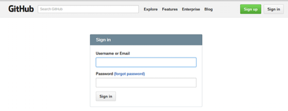
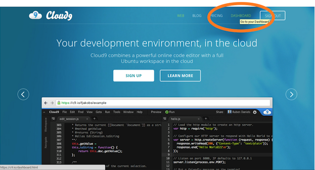
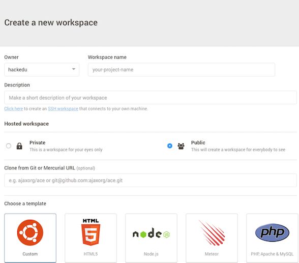
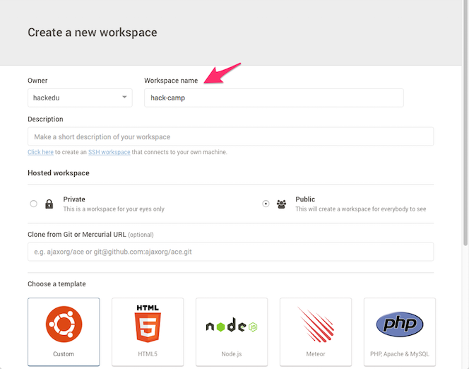
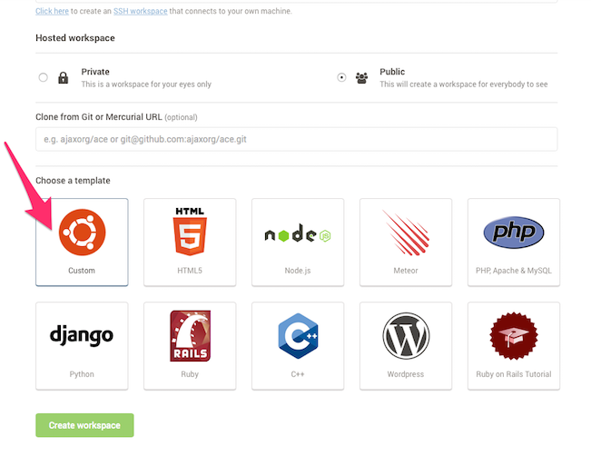
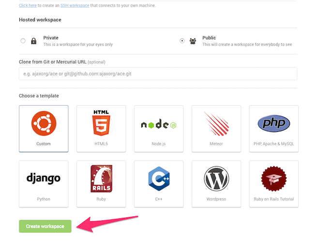

# Setting Up Your Tools

Just like you may write your English essays in Microsoft Word or Google Docs (and not Notepad or TextEdit), we will be writing code in Cloud9.

There other choices besides Cloud9 but it's the easiest and most powerful place.

## Setting Up Cloud9

## Click Create Workspace

## Scroll Down

## Change `Soft Tabs` to `2`

## Close the Welcome Tab

## The Terminal
The arrow here points to what is called the terminal.

## Paste the following command in ther terminal
Paste the following command into the terminal on the bottom and hit `enter`. 

This may take a few minutes to finish.

    curl -sL https://git.io/vtbp6 | sudo dd of=/usr/local/bin/live_reload && sudo chmod +x /usr/local/bin/live_reload && live_reload

## When it's done, your workspace should look like the following

## Next

Great, now you've finished setting up your Cloud9 workspace!

The next step is to start creating the files you actually need for your workspace.

[Creating the files for your website](file_creation.md)
