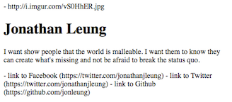

# Description Challenge Solution

## Prompt

We need to figure out how to add a description.

```html
<!-- PORTFOLIO -->

  <!-- IMAGE SECTION -->
    - http://i.imgur.com/vS0HhER.jpg 
  
  <!-- INFORMATION SECTION -->
    <h1>Jonathan Leung</h1>
    - I want show people that the world is malleable. I want them to know they can create what's missing and not be afraid to break the status quo.
    <!-- ^ NEXT -->

  <!-- SOCIAL MEDIA SECTION -->
    - link to Facebook (https://twitter.com/jonathanjleung)
    - link to Twitter (https://twitter.com/jonathanjleung)
    - link to Github (https://github.com/jonleung)
```

## Forming the Query

- `how do you add a paragraph tag`
    - Problem: you did not indicate that you wanted to add a header in `html`
- `how do you add a paragraph tag in html`
    - Problem: you get better results if you put the topic in the front
- `html how do you add a paragraph tag`
    - Problem: the words `how do you` and `a` are extraneous. Google doesn't really care about them.
- `html add paragraph tag`
    - Problem: I know how to add a tag now, so I just want more information on the paragraph tag itself.
- `html paragraph tag`
    - awesome.

## Potential Googling Path

- I google `html paragraph tag`
- [The first result is titled](http://www.w3schools.com/tags/tag_p.asp) `"HTML p tag"` from w3schools. Click it.
- This looks like a helpful site.
- It's telling me to use the paragraph tag the same way I used the `h1` tag

## Using the p Tag

`<p>This is some text in a paragraph.</p>`

Everything you add to your site will between the `body` tags, like so:

```
<body>

<!-- EVERYTHING -->

</body>
```

You're going to add an opening and closing paragraph tag around the description you wrote about yourself, like so:

```
<p>I want show people that the world is malleable. I want them to know they can create what's missing and not be afraid to break the status quo.</p>
```

## Refresh Again

to see what your page looks like now.


## Solution

```html
<!DOCTYPE html>
<html>
  <head>
    <title>Zaphod's Portfolio</title>
  </head>
  <body>
  <!-- PORTFOLIO -->
  
    <!-- IMAGE SECTION -->
      - http://i.imgur.com/vS0HhER.jpg
  
    <!-- INFORMATION SECTION -->
      <h1>Jonathan Leung</h1>
      <p>I want show people that the world is malleable. 
         I want them to know they can create what's
         missing and not be afraid to break the status quo.</p>
  
    <!-- SOCIAL MEDIA SECTION -->
      - link to Facebook (https://twitter.com/jonathanjleung)
      - link to Twitter (https://twitter.com/jonathanjleung)
      - link to Github (https://github.com/jonleung)

  </body>
</html>
```
## Preview

## Some Vocabulary

- p tag stands for paragraph tag.
- you can write paragraphs in paragraph tags

```html
<p>This is some text in a paragraph.</p>
^^^ this is called                  ^^^^ this is called
    an opening                           a closing tag
    tag 
```

```html
<p>This is some text in a paragraph.</p>
 ^ this tag is specifically is called an p tag
```

```html
<p>This is some text in a paragraph.</p>
   ^^^^^^^^^^^^^^^^^^^^^^^^^^^^^^^^^ this is called the inner html
```

```html
<p>This is some text in a paragraph</p>
^^^^^^^^^^^^^^^^^^^^^^^^^^^^^^^^^^^^^^^ this entire thing is called an element
```


## Solution

```html
<!-- PORTFOLIO -->

  <!-- IMAGE SECTION -->
    - http://i.imgur.com/vS0HhER.jpg 
  
  <!-- INFORMATION SECTION -->
    <h1>Jonathan Leung</h1>
    <p>I want show people that the world is malleable. 
       I want them to know they can create what's missing
       and not be afraid to break the status quo.</p> <!-- SOLUTION -->
    
  <!-- SOCIAL MEDIA SECTION -->
    - link to Facebook (https://twitter.com/jonathanjleung)
    - link to Twitter (https://twitter.com/jonathanjleung)
    - link to Github (https://github.com/jonleung)
```



I notice that the text is starting to shape up now.

## Next

Now we need to figure out [how to add the image](image_challenge.md).