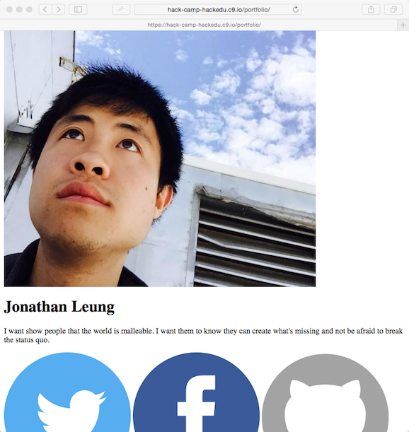

# Linking to Logos Solution

## Prompt

```html
<!-- PORTFOLIO -->

  <!-- IMAGE SECTION -->
    
  
  <!-- INFORMATION SECTION -->
    <h1>Jonathan Leung</h1>
    <p>I want show people that the world is malleable. 
       I want them to know they can create what's missing
       and not be afraid to break the status quo.</p> 
    
  <!-- SOCIAL MEDIA SECTION -->
    <a href="https://twitter.com/jonathanjleung">Twitter</a> <!-- NEXT -->
    <a href="https://facebook.com/jonleung137">Facebook</a>  <!-- NEXT -->
    <a href="https://github.com/jonleung">Github</a>         <!-- NEXT -->
```
## How I Googled

- I googled `html link to image`
- opened the [first google result which is a w3schools page](http://www.w3schools.com/tags/tryit.asp?filename=tryhtml_link_image)
  - I tried looking at the code and got a bit confused
- So I opened [the next google result](http://www.w3schools.com/html/html_images.asp)
  - I've seen this page before. Also I see this page is about images, not links but google took me here so there's something about links on the page.
  - So I want to search for links on the page so I press
    - `cmd + f` on a mac
    - `ctrl + f` on windows
  - Low and behold I see `Using an Image as a Link` with a clearer example
    ```
    <a href="default.asp">
      
    </a>
    ```

```markdown
Pro-tip!

{o,o}
./)_)
  " "

As a reminder we see inline styles here.
Inline styles are bad.

If you want to learn more about why, google `inline styles bad`
```

- And if we take away the inline style

  ```
  <a href="default.asp">
    
  </a>
  ```

- The w3 school page also mentions
> To use an image as a link, simply nest the `` tag inside the `<a>` tag:

- If you google `what does nesting html mean` you will find out that nesting means putting one tag inside of another. So nesting the `` tag inside the `<a>` tag simply means "putting" the `` tag inside the `<a>` tag

## The Solution

So it seems like I do something like this:

```html
<a href="https://twitter.com/jonathanjleung">
  
</a>
```

So it seems that instead of doing

```html
<a href="https://twitter.com/jonathanjleung">Twitter</a>
```

Which can be rewritten as

```html
<a href="https://twitter.com/jonathanjleung">
  Twitter
</a>
```

We can just replace the text `Twitter` with an image element

```html
<a href="https://twitter.com/jonathanjleung">
  
</a>
```

And if I have 3 links:

```html
<a href="https://twitter.com/jonathanjleung">
  
</a>
<a href="https://facebook.com/jonleung137">
  
</a>
<a href="https://github.com/jonleung">
  
</a>
```

## Solution

```html
<!-- PORTFOLIO -->

  <!-- IMAGE SECTION -->
    
  
  <!-- INFORMATION SECTION -->
    <h1>Jonathan Leung</h1>
    <p>I want show people that the world is malleable. 
       I want them to know they can create what's missing
       and not be afraid to break the status quo.</p> 
    
  <!-- SOCIAL MEDIA SECTION -->
    <a href="https://twitter.com/jonathanjleung">
      
    </a>
    <a href="https://facebook.com/jonleung137">
      
    </a>
    <a href="https://github.com/jonleung">
      
    </a>

    <!-- ^ SOLUTION -->
```



Yay! Now it seems that all of the ements on the page are present!

## Next

[Put our code permanently on the live internet!](github.md)