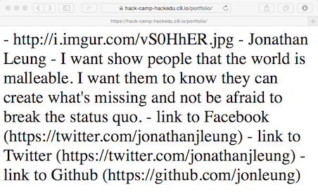

# Solution: Outlining your code

Note that there are many ways to outline this. This is just one potential solution.

## Solution


```
index.html

<!DOCTYPE html>
<html>
  <head>
    <title>Zaphod's Portfolio</title>
  </head>
  <body>
    - portfolio
      - image section
        - image
      - informational section
        - name
        - description
      - social media section
        - link to Facebook
        - link to Twitter
        - link to Github
  </body>
</html>
```


## Filling In the names

We can start to replace 
- `name` with `Jonathan Leung` and
- `description` with `I want to show...`

```html
<!-- Note, all subsequent code is written without any tags
except those that are used in the body -->

- portfolio
  - image section
    - http://i.imgur.com/vS0HhER.jpg
  - informational section
    - Jonathan Leung
    - I want show people that the world is malleable. I want them to know they can create what's missing and not be afraid to break the status quo.
  - social media section
    - link to Facebook (https://twitter.com/jonathanjleung)
    - link to Twitter (https://twitter.com/jonathanjleung)
    - link to Github (https://github.com/jonleung)
```

## Placeholding

We are using the above outline as a placeholders for our code that will soon be written. Throughout this tutorial, we will be replacing each bullet point with real HTML code. Having a scaffold reminds us of the entire structure of the code and helps us figure out where we want to go next.

## Viewing the Result


- Open the `Preview` menu
- then click on `Preview Running Application`
- Click the white arrow to pop the preview in a new tab
- Move the newly created tab to a new window

## The Result


The above certainly looks weird. That's because right now we just have an outline.

The first thing to make this look closer to our actual website though, is to hide the bullet points we don't want in the final website to show up as text.

For example, `image section` and `informational section` for instance should not be displayed.

## Things To Be Removed


To tell the computer to ignore something, we can put the text inside of these things:

`<!-- all text inside of these things will be ignored by the computer-->`

## Our New Outline

(which now has all of those section titles removed)

```
<!-- PORTFOLIO -->

  <!-- IMAGE SECTION -->
    - http://i.imgur.com/vS0HhER.jpg
  
  <!-- INFORMATION SECTION -->
    - Jonathan Leung
    - I want show people that the world is malleable. I want them to know they can create what's missing and not be afraid to break the status quo.

  <!-- SOCIAL MEDIA SECTION -->
    - link to Facebook (https://twitter.com/jonathanjleung)
    - link to Twitter (https://twitter.com/jonathanjleung)
    - link to Github (https://github.com/jonleung)
```




## Next

[A bit more information about the structure of this tutorial](tutorial_format.md)